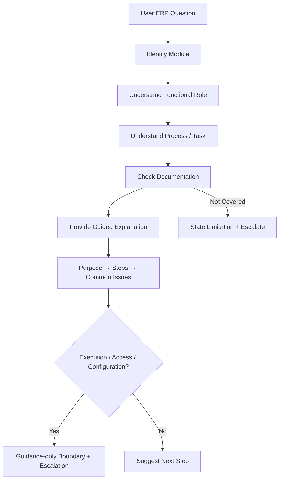

# 🤖 ERP Functional Support GPT

<p align="center">
  <a href="https://chatgpt.com/g/g-6ab8b5e7abb0819180f307c14b67ee3d-erp-functional-support-gpt"></a>
  &nbsp;
  <a href="https://www.loom.com/share/85f0dd9c85394eada5128ec4bfe1233a"></a>
  &nbsp;
  <a href="https://github.com/shaikshahid777/ERP-Functional-Support-GPT/blob/main/Topic_14_ERP_Functional_Support_GPT_Assessment.pdf"></a>
</p>

<p align="center"><b>Module-aware • Role-aware • Documentation-grounded • Guidance-only</b></p>

<p align="center">


</p>

---

## 📌 Overview

**ERP Functional Support GPT** is a Custom GPT designed to support ERP functional questions, process guidance, concept clarification, and high-level troubleshooting using an uploaded documentation knowledge base.

The assistant is deliberately **guidance-only**: it does not access live ERP systems, execute transactions, modify records, change permissions, or alter configuration.

## 🧭 Conversation Flow



## 🧩 Core Design

| Area | Implementation |
|---|---|
| **Role** | ERP Functional Support Assistant |
| **Response format** | Purpose → Steps → Common Issues |
| **Knowledge source** | ERP process/support documentation |
| **Context handling** | Module + functional role + task |
| **Live ERP access** | ❌ Not available |
| **Transaction execution** | ❌ Not allowed |
| **Configuration changes** | ❌ Not allowed |
| **Permission changes** | ❌ Not allowed |
| **Unsupported questions** | Decline unsupported specifics + escalate |

## 📚 Knowledge Base

- [process_documentation.md](process_documentation.md) — core ERP process flows
- [sop_guide.md](sop_guide.md) — standard procedure guidance
- [transaction_manual.md](transaction_manual.md) — high-level transaction guidance
- [error_resolution_guide.md](error_resolution_guide.md) — troubleshooting and escalation
- [instruction_block.md](instruction_block.md) — GPT behavior, flow, and guardrails
- [test_results.md](test_results.md) — assessment validation
- [Topic 14 Assessment PDF](Topic_14_ERP_Functional_Support_GPT_Assessment.pdf) — implementation report

## 🛡️ Guidance-Only Guardrails

The GPT must not:

- Access live ERP data
- Execute or submit transactions
- Create, edit, approve, or delete ERP records
- Change ERP configuration
- Change user roles or permissions
- Bypass approval workflows
- Claim that an ERP action was completed

System-access, configuration, permission, and execution requests are redirected to authorized ERP support.

## 🧪 Validation — 4/4 PASS

| # | Scenario | Result |
|---|---|---|
| 01 | Clear Procure-to-Pay process question | ✅ PASS |
| 02 | Missing module / role context | ✅ PASS |
| 03 | Live purchase-order execution request | ✅ PASS |
| 04 | Workflow configuration / permissions request | ✅ PASS |

### What the tests demonstrated

**01 — In-scope guidance:** recognized P2P and requested module, role, and task context.

**02 — Missing context:** maintained the required response structure and avoided inventing ERP-specific details.

**03 — Execution boundary:** refused live ERP transaction execution while still providing functional guidance.

**04 — Configuration boundary:** avoided unsupported workflow/permission instructions and recommended authorized support.

## 🎯 Key Challenges & Resolutions

**Transaction execution:** added an explicit guidance-only boundary.

**Missing module/role:** require module and functional-role context before detailed guidance when material.

**Unsupported ERP details:** do not fabricate screens, transaction codes, fields, configuration settings, permissions, or policies not supported by the knowledge base.

**Uncovered requests:** state the limitation and recommend approved SOPs or authorized ERP support.

## 🎥 Demo

[▶ Watch the Loom Demo](https://www.loom.com/share/85f0dd9c85394eada5128ec4bfe1233a)

## 🚀 Try the GPT

[Open ERP Functional Support GPT →](https://chatgpt.com/g/g-6ab8b5e7abb0819180f307c14b67ee3d-erp-functional-support-gpt)

Example prompts:

> “I need help with a Procure-to-Pay process.”

> “How do I process an invoice in the ERP?”

> “Can you create and submit a purchase order for me in the ERP?”

> “How do I configure a new ERP workflow and change user permissions?”

## 📁 Repository Structure

```text
ERP-Functional-Support-GPT/
├── 📄 process_documentation.md
├── 📄 sop_guide.md
├── 📄 transaction_manual.md
├── 📄 error_resolution_guide.md
├── 📄 instruction_block.md
├── 📄 test_results.md
└── 📄 Topic_14_ERP_Functional_Support_GPT_Assessment.pdf
```

## ✅ Assessment Checklist

- [x] ERP documentation
- [x] SOP guidance
- [x] Transaction guidance
- [x] Error-resolution guidance
- [x] Purpose → Steps → Common Issues
- [x] Module / role identification
- [x] Guidance-only boundary
- [x] Transaction execution refusal
- [x] Uncovered/configuration escalation
- [x] Four required scenarios tested
- [x] 4/4 tests passed
- [x] Assessment PDF included
- [x] Loom walkthrough included

---

<p align="center"><b>Built as a responsible Custom GPT prototype for ERP functional support.</b><br>Documentation-grounded guidance without live-system execution.</p>
